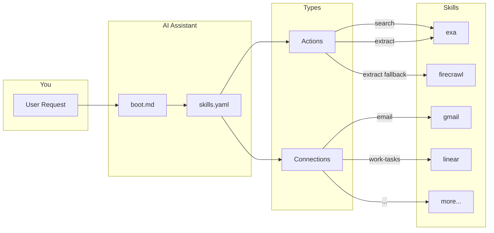

# AgentOS

Supercharge your AI assistant with real-world skills via terminal access.

## How It Works



**Skills** are services you connect to. They come in two types:
- **Actions** — stateless verbs (search, extract, transcribe)
- **Connections** — your data (email, calendar, crm, tasks)

The AI reads `skills.yaml` to find which skill handles each request, with fallbacks when needed.

## Available Skills

###  macOS Native
*Direct access to local apps*

| Skill | What it does |
|-------|--------------|
|  [Calendar](skills/apple-calendar/README.md) | Read & manage calendar events |
|  [Contacts](skills/apple-contacts/README.md) | Search, read & manage contacts |
|  [iMessages](skills/imessages/README.md) | Read messages & conversations |
|  [WhatsApp](skills/whatsapp/README.md) | Read WhatsApp messages & conversations |
|  [Copilot Money](skills/copilot/README.md) | Balances, transactions, net worth |

### ☁️ Cloud APIs
*Requires internet & API keys*

| Skill | What it does |
|-------|--------------|
|  [Gmail](skills/gmail/README.md) | Read emails, search, draft messages |
|  [Google Drive](skills/google-drive/README.md) | List, search & read files |
|  [Todoist](skills/todoist/README.md) | Personal task management |
|  [Linear](skills/linear/README.md) | Work project & issue tracking |
|  [GitHub](skills/github/README.md) | Issues, PRs, repo management |
|  [Raindrop](skills/raindrop/README.md) | Bookmark management |
|  [Exa](skills/exa/README.md) | Semantic web search & extraction |
|  [Firecrawl](skills/firecrawl/README.md) | Extract content from JS-heavy URLs |
|  [YouTube](skills/youtube/README.md) | Video transcription |
| ✈️ [Flights](skills/google-flights/README.md) | Search & compare flights |
|  [Enrich](skills/enrich-so/README.md) | Email/phone/domain lookup |
|  [Apollo CRM](skills/apollo/README.md) | Accounts, contacts, deals, sequences |

## Automated Setup (AI-Assisted)

Paste this into your AI chat ([Cursor](https://cursor.com/) agent, or any AI with terminal access):

```
Clone AgentOS, read the README, and guide me through setup:
git clone https://github.com/jcontini/AgentOS.git && cat AgentOS/README.md
```

That's it. The AI handles the rest. (Prefer manual setup? [Jump to instructions](#manual-setup))

## Manual Setup

If you prefer to set things up yourself:

1. **Clone the repo:**
   ```bash
   git clone https://github.com/jcontini/AgentOS.git
   cd AgentOS
   ```

2. **Add to your AI system prompt:**

   **Cursor** (Settings → Rules for AI), **Claude Desktop** (Settings → User Preferences), or **other LLM clients**:
   ```
   AGENTOS_ROOT=/path/to/AgentOS

   STOP. Before responding, read $AGENTOS_ROOT/boot.md (try: cat command, or any file reading tool).
   ```

   Replace `/path/to/AgentOS` with your actual AgentOS installation path.

3. **Create `.env`** with API keys you want:
   ```bash
   cat > .env << 'EOF'
   EXA_API_KEY=your_key
   LINEAR_API_KEY=your_key
   TODOIST_API_KEY=your_key
   SERPAPI_API_KEY=your_key
   RAINDROP_API_TOKEN=your_token
   EOF
   ```

4. **Create `user/profile.md`** with info about yourself

5. **macOS users**: System Settings → Privacy & Security → Full Disk Access → Add terminal

**Notes:**
- `.env` and `user/` are gitignored - your secrets stay local
- macOS required for Calendar, iMessages, Contacts only - everything else is cross-platform

## Repository Structure

- **`skills/`** - Skill documentation and scripts. Each skill has its own folder with `README.md`.
- **`skills.yaml`** - Routing table mapping actions/connections to skills.
- **`utils/`** - Utility scripts (timezone, setup guides)
- **`user/`** - User-specific content (gitignored)
  - **`user/skills-data/`** - Generated data from skills
  - **`user/profile.md`** - User preferences and context
  - **`user/reports/`** - User-generated reports
- **`.env`** - API keys (gitignored)

## Philosophy

AgentOS is designed with speed and simplicity in mind:
- **Terminal-first**: All operations use terminal commands and direct API calls (no MCP overhead)
- **Self-contained**: Each skill includes everything needed to use it
- **Extensible**: Easy to add new skills (see `utils/creating-skills.md`)
- **User-specific**: Personal preferences and secrets stay in `user/` folder
- **Optimized for speed**: Chain commands, batch API calls, and minimize latency

## License

See [LICENSE](LICENSE) file for details.

---

## For AI Assistants

**Detecting if setup is needed:**
```bash
[ -f .env ] && [ -f user/profile.md ] && echo "READY" || echo "NEEDS_SETUP"
```

This checks if both `.env` (API keys) and `user/profile.md` (user context) exist. If either is missing, setup hasn't been completed.

**If `NEEDS_SETUP`:** Read `utils/setup.md` and guide the user through interactive setup.

**If `READY`:** Proceed with the user's request. Read `boot.md` for available skills and `user/profile.md` for user context.
