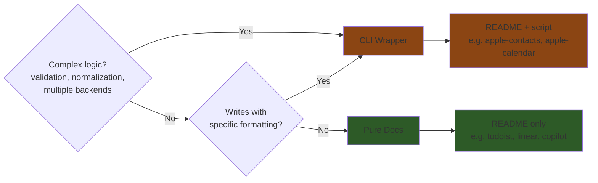

# Creating Skills

## Intention: Guide for creating new skills in this repository

When creating new skills in `skills/`, follow these patterns and best practices.

## Concepts

| Term | What it is |
|------|-----------|
| **Skill** | A service you connect to (Exa, Gmail, Linear, Apollo) |
| **Action** | A type of skill — stateless verbs (search, extract) |
| **Connection** | A type of skill — your data (email, crm, calendar) |

## TLDR: Which Approach?



See [Skill Architecture](#skill-architecture) for details.

## Skill Architecture

Choose the right approach based on complexity:

| Approach | When to Use | Examples |
|----------|-------------|----------|
| **Pure docs** | Straightforward APIs/queries, read-only, AI can compose | Todoist, Linear, Copilot |
| **CLI wrapper** | Complex logic, validation, writes, multiple backends | Apple Contacts |

### Pure Docs (Preferred)

README only — no wrapper script. AI reads docs and composes commands directly.

**Use when:**
- API/database queries are straightforward
- No complex validation or normalization needed
- Read-only or simple writes
- AI can compose queries from schema + patterns

**README includes:**
- Schema/API reference (fields, types, not full specs)
- 3-5 essential query patterns
- Notes on conventions (date formats, field meanings)

### CLI Wrapper

README + script. Script encapsulates complex logic.

**Use when:**
- Complex validation/normalization (e.g., phone number formatting)
- Multiple backends (e.g., SQLite reads + AppleScript writes)
- State management or caching
- Error-prone operations that need guardrails

**README documents:**
- CLI commands and options
- Output format
- Technical details (for debugging)

## Context Optimization

**Target: ~100-150 lines per README.** The AI reads these files, so optimize for:

- **Density over verbosity** — One good example beats five similar ones
- **Schema + patterns** — Give structure, let AI compose specifics
- **Tables over prose** — Faster to scan, less context
- **Omit the obvious** — AI knows curl, jq, SQL basics

## File Structure

- **Minimal files** — README + implementation file(s). No unnecessary abstraction.
- **Choose the right tool:**
  - **Swift** — macOS system APIs (EventKit, Contacts framework)
  - **Bash** — Simple API calls with curl
  - **Python** — Complex APIs, data processing, when libraries help
  - **Direct tools** — SQLite, jq — use directly in README examples
- **No user-specific content** — Use generic examples (`user@example.com`). User data belongs in `user/` or `.env`.

## Adding a New Skill

1. Create folder: `skills/{skill-name}/`
2. Add `README.md` with:
   - What it provides (action and/or connection)
   - Auth setup
   - Usage examples
3. Add scripts if needed
4. Register in `skills.yaml`:
   ```yaml
   actions:
     your-action: [your-skill]
   # or
   connections:
     your-connection: [your-skill]
   ```

## Output Format

- **JSON for AI consumption** — Output JSON to stdout
- **Technical error messages** — Include details for debugging

## Environment Variables & Secrets

- **API keys → `.env`** — Store in `$PROJECT_ROOT/.env`, never hardcode
- **Skill-specific files → `user/skills-data/`** — Service account keys, certs, cached data go in `user/skills-data/{skill-name}/`
- **Document required vars** — List env vars needed in README
- **Bash pattern:** `set -a && source "$PROJECT_ROOT/.env" && set +a && command`
- **Never commit secrets** — `.env` and `user/` are gitignored

## Examples by Pattern

| Pattern | Skill | Structure |
|---------|-------|-----------|
| Pure docs (REST API) | `skills/todoist/` | README with curl examples |
| Pure docs (GraphQL) | `skills/linear/` | README with query patterns |
| Pure docs (SQLite) | `skills/copilot/` | README with sqlite3 examples |
| CLI wrapper (Python) | `skills/apple-contacts/` | README + `contacts.py` |
| CLI wrapper (Swift) | `skills/apple-calendar/` | README + `.swift` files |
| CLI wrapper (Bash) | `skills/enrich-so/` | README + `enrich.sh` |

## See Also

- **Terminal Usage** — See `boot.md` for command patterns
